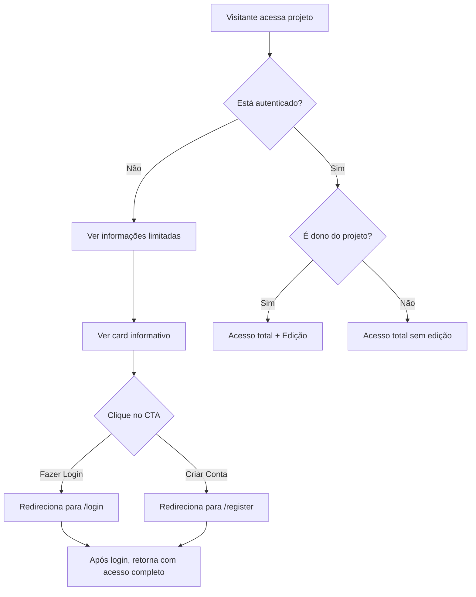

# 🔒 Restrições de Acesso para Visitantes - Implementação Completa

## 📋 Visão Geral

Este documento descreve as restrições de acesso implementadas para visitantes (usuários não autenticados) na página de visualização de projetos.

**Arquivo modificado:** `src/features/student/project-view/ProjectViewPage.tsx`

---

## 🎯 Objetivo

Garantir que visitantes tenham **acesso limitado** às informações do projeto, vendo apenas:
- Banner e descrição básica
- Informações públicas (curso, turma, badges)
- Equipe (sem botões de contato)

**Bloqueado para visitantes:**
- ❌ Navegação entre fases (Ideação, Desenvolvimento, Execução, Produto Final)
- ❌ Etapas detalhadas de cada fase
- ❌ Anexos e documentos das etapas
- ❌ Cronograma com datas de início e fim
- ❌ Botões de contato direto (email/WhatsApp)

---

## 🛠️ Implementação Técnica

### 1. **Condição de Verificação**

Utilizamos duas variáveis para controlar o acesso:
- `isGuest`: Indica se o usuário está em modo visitante
- `isAuthenticated`: Indica se há uma sessão ativa

```typescript
const isGuest = useGuest().isGuest
const isAuthenticated = !!user
```

### 2. **Bloqueio de Navegação entre Fases**

**Localização:** ~linha 380

```tsx
{!isGuest && isAuthenticated && (
  <div className="grid grid-cols-4 gap-3">
    {phases.map((phase) => (
      <button
        key={phase.id}
        onClick={() => setActivePhase(phase.id)}
        className={`flex flex-col items-center gap-2 p-4 rounded-xl transition-all ${
          activePhase === phase.id
            ? 'bg-gradient-to-br from-blue-600 to-indigo-600 text-white shadow-lg'
            : 'bg-white dark:bg-gray-800 hover:bg-gray-50 dark:hover:bg-gray-700 border-2 border-gray-200 dark:border-gray-700'
        }`}
      >
        <phase.icon className="w-6 h-6" />
        <span className="text-sm font-bold">{phase.name}</span>
      </button>
    ))}
  </div>
)}
```

### 3. **Bloqueio de Etapas e Anexos**

**Localização:** ~linha 420

```tsx
{!isGuest && isAuthenticated && (
  <div className="mt-6">
    <div className="flex items-center gap-3 mb-6">
      <PhaseIcon className="w-8 h-8 text-blue-600 dark:text-blue-400" />
      <div>
        <h3 className="text-2xl font-bold text-gray-900 dark:text-white">
          Etapas da Fase: {currentPhase.name}
        </h3>
        <p className="text-sm text-gray-600 dark:text-gray-400 mt-1">
          {currentPhase.description}
        </p>
      </div>
    </div>

    {/* Renderização das etapas e anexos */}
    {/* ... conteúdo completo ... */}
  </div>
)}
```

### 4. **Card Informativo para Visitantes**

**Localização:** ~linha 688

Um card visualmente atrativo exibe ao visitante o que ele está perdendo:

```tsx
{isGuest && (
  <div className="bg-gradient-to-r from-amber-50 to-orange-50 dark:from-amber-900/20 dark:to-orange-900/20 rounded-xl shadow-sm border-2 border-amber-200 dark:border-amber-800 p-6">
    <div className="flex items-start gap-4">
      <div className="flex-shrink-0 p-3 bg-amber-500 rounded-full">
        <Lock className="w-6 h-6 text-white" />
      </div>
      <div className="flex-1">
        <h3 className="text-xl font-bold text-amber-900 dark:text-amber-300 mb-3">
          Conteúdo Exclusivo para Usuários Cadastrados
        </h3>
        <p className="text-amber-800 dark:text-amber-200 mb-4">
          Como visitante, você tem acesso limitado. Faça login para visualizar:
        </p>
        <ul className="space-y-2 mb-5">
          <li>Etapas detalhadas do projeto por fase</li>
          <li>Anexos e documentos das etapas</li>
          <li>Cronograma completo com datas</li>
          <li>Contato direto com equipe e orientadores</li>
          <li>Navegação entre fases do projeto</li>
        </ul>
        <div className="flex items-center gap-3">
          <button onClick={() => navigate('/login')}>
            Fazer Login
          </button>
          <button onClick={() => navigate('/register')}>
            Criar Conta
          </button>
        </div>
      </div>
    </div>
  </div>
)}
```

---

## 🎨 Design do Card Informativo

### Elementos Visuais:
- **Gradiente:** Âmbar → Laranja (claro/escuro conforme tema)
- **Ícone:** Cadeado (Lock) em círculo âmbar
- **Borda:** 2px sólida âmbar com cantos arredondados
- **Botões CTA:**
  - "Fazer Login": Gradiente âmbar-laranja com sombra
  - "Criar Conta": Branco/cinza com borda âmbar

### Lista de Benefícios:
Cada item tem:
- Bullet point circular âmbar
- Texto em negrito para destacar palavras-chave
- Contraste adequado para dark mode

---

## 📊 Níveis de Acesso

| Recurso | Visitante | Usuário Autenticado | Dono do Projeto |
|---------|-----------|---------------------|-----------------|
| Banner & Descrição | ✅ | ✅ | ✅ |
| Badges (Itinerário, Lab Maker, SAGA) | ✅ | ✅ | ✅ |
| Informações Básicas | ✅ | ✅ | ✅ |
| Visualização de Equipe | ✅ (sem contato) | ✅ (com contato) | ✅ (com contato) |
| Navegação entre Fases | ❌ | ✅ | ✅ |
| Etapas Detalhadas | ❌ | ✅ | ✅ |
| Anexos/Documentos | ❌ | ✅ | ✅ |
| Cronograma | ❌ | ✅ | ✅ |
| Editar Projeto | ❌ | ❌ | ✅ |
| Adicionar Etapas | ❌ | ❌ | ✅ |

---

## 🧪 Como Testar

### 1. **Modo Visitante (Guest)**
```bash
# Iniciar o servidor de desenvolvimento
npm run dev

# Acessar a URL (sem fazer login):
http://localhost:5173/app/projects/proj-001/view
```

**Comportamento Esperado:**
- ✅ Ver banner e descrição
- ✅ Ver informações básicas
- ✅ Ver equipe (sem botões de contato)
- ✅ Ver card informativo com CTA para login
- ❌ NÃO ver navegação de fases
- ❌ NÃO ver etapas detalhadas
- ❌ NÃO ver anexos

### 2. **Modo Autenticado (Não Dono)**
```bash
# Fazer login com qualquer usuário
# Acessar projeto de outro usuário:
http://localhost:5173/app/projects/proj-001/view
```

**Comportamento Esperado:**
- ✅ Ver TUDO exceto botão "Editar"
- ✅ Navegar entre fases
- ✅ Ver etapas e anexos
- ✅ Botões de contato funcionando
- ❌ NÃO ver card informativo

### 3. **Modo Dono (Owner)**
```bash
# Fazer login como dono do projeto
# Acessar seu próprio projeto:
http://localhost:5173/app/projects/seu-projeto-id/view
```

**Comportamento Esperado:**
- ✅ Ver TUDO incluindo botão "Editar"
- ✅ Botão "Adicionar Etapa" nas fases vazias
- ✅ Acesso total sem restrições

---

## 🔄 Fluxo de Conversão de Visitante



---

## 📝 Checklist de Implementação

- [x] Bloquear navegação de fases para visitantes
- [x] Bloquear visualização de etapas para visitantes
- [x] Bloquear anexos/documentos para visitantes
- [x] Esconder botões de contato para visitantes
- [x] Adicionar card informativo com lista de benefícios
- [x] Implementar botões CTA (Fazer Login / Criar Conta)
- [x] Adicionar ícone de cadeado (Lock)
- [x] Estilização com gradiente âmbar-laranja
- [x] Suporte a dark mode
- [x] Compilação sem erros
- [x] Documentação completa

---

## 🚀 Próximos Passos Sugeridos

1. **Analytics:** Rastrear quantos visitantes clicam nos CTAs
2. **A/B Testing:** Testar diferentes mensagens no card informativo
3. **Preview Social:** Mostrar preview de 1-2 etapas como "teaser"
4. **Notificação:** Toast quando visitante tenta acessar conteúdo bloqueado
5. **Modal de Login:** Abrir modal inline em vez de redirecionar

---

## 📚 Referências

- Arquivo: `src/features/student/project-view/ProjectViewPage.tsx`
- Contexts: `AuthContext`, `GuestContext`
- Icons: `lucide-react` (Lock, LogIn)
- Routing: `react-router-dom` (navigate)

---

**Implementado em:** Janeiro 2025  
**Última atualização:** Janeiro 2025  
**Status:** ✅ Completo e funcional
