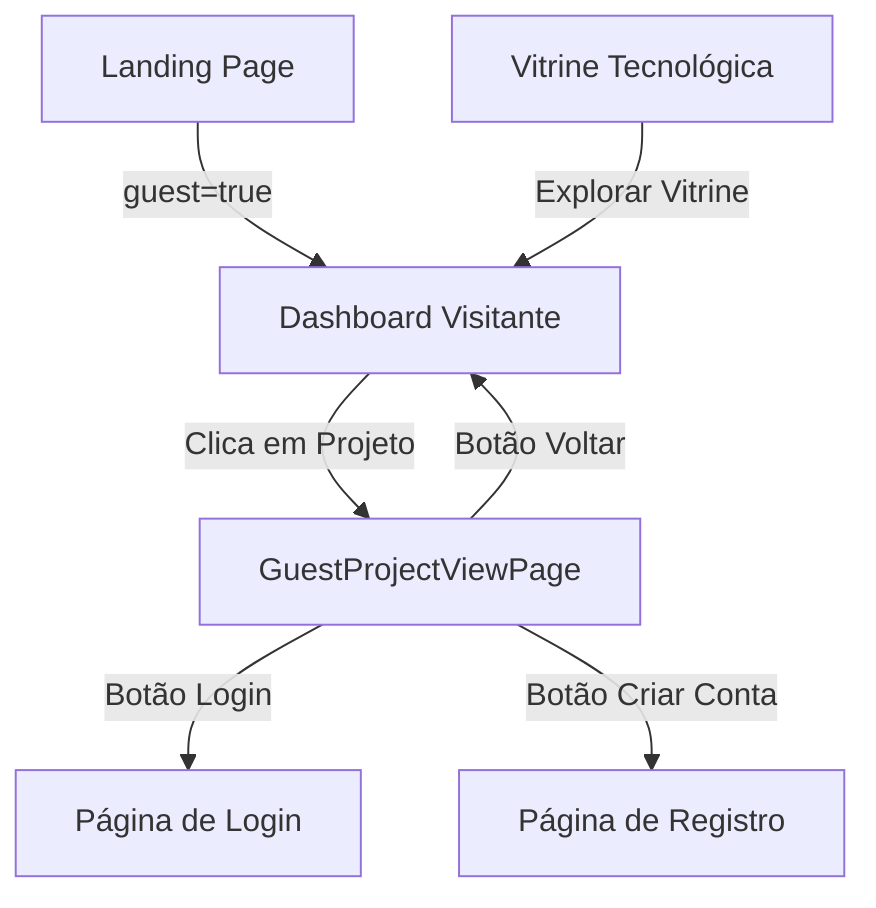

# Página de Visualização de Projetos para Visitantes

## 📋 Resumo

Implementação de uma página específica para visitantes visualizarem projetos com restrições de conteúdo e mensagens claras sobre o que está bloqueado.

## 🎯 Problema Resolvido

Anteriormente, quando um visitante clicava em um projeto na landing page ou dashboard, o sistema:
- Redirecionava para `/login` automaticamente
- Impedia a visualização dos detalhes do projeto
- Não explicava claramente o que estava bloqueado

**Logs do erro:**
```
guest-context.tsx:35 🎯 GuestProvider - Location change: /login 
guest-context.tsx:36 🎯 GuestProvider - Current isGuest state: false
guest-context.tsx:82 🎯 GuestProvider - NOT guest mode - setando isGuest para false
```

## ✨ Solução Implementada

### 1. Nova Página de Visitante
**Arquivo:** `src/features/visitor/project-view/GuestProjectViewPage.tsx`

Uma página dedicada que exibe:

#### ✅ Conteúdo Visível (Público)
- Banner do projeto
- Título e descrição
- Informações básicas (curso, turma, categoria, modalidade)
- Badges (Itinerário, Lab Maker, SAGA)
- Unidade Curricular
- Repositório (se público)
- Equipe do projeto (nomes)
- Fase atual do projeto

#### 🔒 Conteúdo Restrito (Requer Login)
- **Etapas detalhadas** de cada fase (Ideação, Modelagem, Prototipagem, Validação)
- **Anexos e documentos** das etapas
- **Cronograma completo** com datas
- **Contato direto** com orientadores e equipe
- **Navegação entre fases** do projeto

### 2. Banner de Modo Visitante
Banner fixo no topo destacando:
- 🔍 Modo Visitante ativo
- Visualização limitada
- Botões para Login e Criar Conta

### 3. Card de Restrição Visual
Card grande e visualmente atrativo explicando:
- O que está bloqueado
- Por que fazer login
- Benefícios de cada funcionalidade bloqueada

### 4. Atualização de Rotas

**Arquivo:** `src/routes/router.tsx`

```tsx
// Nova rota para visitantes
<Route path="/guest/project/:id" element={<GuestProjectViewPage />} />
```

### 5. Redirecionamento no Dashboard

**Arquivo:** `src/features/student/dashboard/components/guest-dashboard.tsx`

```tsx
const handleOpenModal = (project: any) => {
  // Visitantes agora vão para a página específica
  navigate(`/guest/project/${project.id}`)
}
```

### 6. Atualização na Vitrine Tecnológica

**Arquivo:** `src/features/visitor/sections/VitrineTecnologica.tsx`

```tsx
// Link atualizado para modo visitante
<a href="/?guest=true" ...>
  Explorar Vitrine Completa
</a>
```

## 🎨 Design & UX

### Esquema de Cores
- **Banner Visitante:** Gradiente azul → índigo → roxo
- **Card de Restrição:** Gradiente âmbar → laranja → vermelho
- **Ícones de Bloqueio:** Âmbar/Laranja com fundo gradiente

### Componentes Visuais

#### Banner Informativo
```
🔍 Modo Visitante - Visualização Limitada
Algumas informações estão ocultas. Faça login para acessar o conteúdo completo!
[Criar Conta] [Fazer Login]
```

#### Card de Conteúdo Bloqueado
```
🔒 Conteúdo Exclusivo para Membros

Como visitante, você tem acesso apenas à visão geral do projeto.
Faça login para desbloquear o conteúdo completo:

📄 Etapas Detalhadas por Fase
   Veja o progresso completo em cada fase

📎 Anexos e Documentos
   Acesse todos os arquivos e recursos

📅 Cronograma Completo
   Visualize todas as datas

👥 Contato com a Equipe
   Entre em contato direto

🔄 Navegação entre Fases
   Explore livremente todas as fases

[Fazer Login Agora] [Criar Conta Grátis]
```

### CTAs (Call-to-Action)
- **Primário:** Fazer Login (gradiente laranja)
- **Secundário:** Criar Conta (borda laranja)
- **Sidebar:** Card de registro (gradiente azul)

## 🔄 Fluxo de Navegação



## 🛡️ Restrições de Segurança

### Dados Ocultados
1. **Etapas:** Completamente ocultas
2. **Anexos:** Mostrar quantidade, mas não links
3. **Contatos:** Email de orientadores ocultos
4. **Navegação:** Fases bloqueadas

### Dados Visíveis
1. Informações públicas do projeto
2. Estrutura geral
3. Equipe (nomes apenas)
4. Estatísticas básicas

## 📱 Responsividade

- ✅ Mobile-first design
- ✅ Grid adaptável (1 col mobile, 3 cols desktop)
- ✅ Banner responsivo com stack vertical em mobile
- ✅ Modais otimizados para touch

## 🎯 Benefícios

### Para Visitantes
- ✅ Visualização clara do que está disponível
- ✅ Entendimento do que ganha ao fazer login
- ✅ Navegação fluida sem redirecionamentos forçados
- ✅ CTAs claros e acessíveis

### Para o Sistema
- ✅ Maior conversão de visitantes → usuários
- ✅ Experiência de usuário melhorada
- ✅ Redução de frustração
- ✅ Segurança mantida

## 🚀 Como Testar

### 1. Modo Visitante
```
1. Acesse: http://localhost:5173/?guest=true
2. Clique em qualquer projeto
3. Verifique se vai para /guest/project/:id
4. Confirme que etapas estão ocultas
5. Clique em "Fazer Login"
```

### 2. Modo Autenticado
```
1. Faça login normalmente
2. Acesse um projeto
3. Confirme que vai para /app/projects/:id/view
4. Verifique que todas as etapas estão visíveis
```

### 3. Navegação
```
1. Landing Page → Vitrine Tecnológica
2. Clique em "Explorar Vitrine Completa"
3. Confirme redirecionamento para /?guest=true
4. Dashboard visitante deve carregar
```

## 📝 Arquivos Modificados

1. ✅ `src/features/visitor/project-view/GuestProjectViewPage.tsx` (NOVO)
2. ✅ `src/routes/router.tsx`
3. ✅ `src/features/student/dashboard/components/guest-dashboard.tsx`
4. ✅ `src/features/visitor/sections/VitrineTecnologica.tsx`

## 🐛 Possíveis Issues

### Issue 1: Redirecionamento de Login
**Sintoma:** Visitante é redirecionado para login ao clicar em projeto
**Solução:** Usar rota `/guest/project/:id` em vez de rotas autenticadas

### Issue 2: Estado do GuestContext
**Sintoma:** `isGuest` fica como `false` após mudança de rota
**Solução:** Persistir estado no localStorage com chave `isGuest`

### Issue 3: Modal abrindo em vez de navegar
**Sintoma:** Modal de projeto abre em vez de ir para página
**Solução:** Modificar `handleOpenModal` para usar `navigate()`

## 📊 Métricas de Sucesso

- ✅ Taxa de conversão visitante → usuário
- ✅ Tempo de permanência na página
- ✅ Taxa de cliques nos CTAs
- ✅ Bounce rate reduzido

## 🎓 Próximos Passos (Opcional)

1. **Analytics:** Adicionar tracking de eventos
2. **A/B Testing:** Testar diferentes mensagens
3. **Preview:** Mostrar preview das primeiras etapas
4. **Gamification:** Badge "Cadastre-se para desbloquear"
5. **Social Proof:** "X usuários já visualizaram este projeto"

## 📞 Suporte

Para dúvidas ou problemas:
1. Verificar logs do console
2. Confirmar estado do `GuestContext`
3. Validar rotas no `router.tsx`
4. Testar fluxo completo de visitante

---

**Implementado em:** 24 de outubro de 2025
**Status:** ✅ Concluído
**Versão:** 1.0
