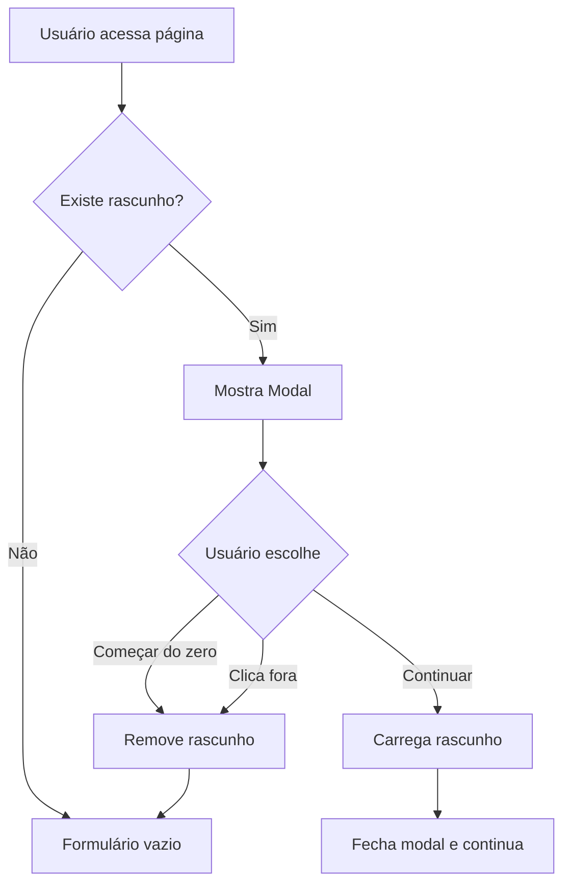

# Modal de Recuperação de Rascunho

## 📋 Visão Geral

Modal bonito e interativo que substitui o `window.confirm` padrão, oferecendo uma experiência moderna para recuperar rascunhos salvos de projetos.

## ✨ Funcionalidades Implementadas

### 1. **Modal Moderno e Animado**
- Design com gradientes e efeitos visuais modernos
- Animações suaves usando Framer Motion
- Backdrop com blur para foco no conteúdo
- Responsivo para todos os tamanhos de tela

### 2. **Informações do Rascunho**
- Exibe quando o rascunho foi salvo (data/hora relativa)
- Mostra "há X minutos", "há X horas", "há X dias"
- Formatação inteligente de tempo

### 3. **Duas Opções Claras**

#### Continuar de Onde Parei
- Botão destaque com gradiente azul
- Ícone de refresh animado
- Descrição clara da ação
- Efeito hover com animação

#### Começar do Zero
- Botão secundário com borda
- Ícone de lixeira em gradiente vermelho/laranja
- Confirma que o rascunho será descartado
- Feedback visual no hover

### 4. **Dica Informativa**
- Card azul com informação sobre auto-save
- Ícone de informação
- Texto explicativo sobre salvamento automático

## 🎨 Design

### Cores e Estilos
- **Header**: Gradiente de primary para indigo
- **Continuar**: Gradiente azul com efeito de brilho no hover
- **Começar do Zero**: Branco/cinza com borda
- **Dica**: Fundo azul claro com borda azul

### Animações
- Fade in/out do backdrop
- Scale e translate do modal ao abrir
- Hover effects nos botões
- Ícones animados

### Dark Mode
- Suporte completo ao tema escuro
- Cores ajustadas automaticamente
- Contraste mantido em ambos os temas

## 🔧 Implementação Técnica

### Componente Principal
**Arquivo**: `src/components/modals/DraftRecoveryModal.tsx`

```typescript
interface DraftRecoveryModalProps {
  isOpen: boolean
  onContinue: () => void
  onStartFresh: () => void
  draftDate?: Date
}
```

### Integração
**Arquivo**: `src/features/student/create-project/ImprovedPage.tsx`

#### Estados Adicionados
```typescript
const [showDraftModal, setShowDraftModal] = useState(false)
const [savedDraft, setSavedDraft] = useState<ProjectFormData | null>(null)
const [draftDate, setDraftDate] = useState<Date | undefined>(undefined)
```

#### Auto-Save Melhorado
- Salva não apenas o formData, mas também a data de salvamento
- Estrutura: `{ formData: {...}, savedAt: "ISO_DATE" }`

#### Handlers
```typescript
const handleContinueDraft = () => {
  if (savedDraft) {
    setFormData(savedDraft)
  }
  setShowDraftModal(false)
}

const handleStartFresh = () => {
  localStorage.removeItem('project-draft')
  setSavedDraft(null)
  setShowDraftModal(false)
}
```

## 📱 Responsividade

- **Mobile**: Modal ocupa maior parte da tela com padding
- **Tablet**: Modal com largura máxima de 512px
- **Desktop**: Modal centralizado com largura ideal
- Textos e ícones ajustados para cada breakpoint

## 🎯 UX/UI Highlights

1. **Feedback Visual**
   - Efeito de brilho ao passar o mouse
   - Animação de seta no botão principal
   - Scale suave ao clicar

2. **Hierarquia Visual**
   - Botão "Continuar" é mais proeminente
   - Cores guiam a atenção do usuário
   - Ícones facilitam identificação rápida

3. **Acessibilidade**
   - Contraste adequado em ambos os temas
   - Textos descritivos claros
   - Áreas de clique generosas

4. **Microinterações**
   - Decoração de fundo animada
   - Transições suaves entre estados
   - Feedback imediato nas ações

## 🚀 Como Usar

### Para o Usuário

1. **Quando o modal aparece**
   - Ao acessar a página de criar projeto com um rascunho salvo

2. **Opções disponíveis**
   - Clicar em "Continuar de onde parei" para retomar o trabalho
   - Clicar em "Começar do zero" para descartar o rascunho
   - Clicar fora do modal também descarta o rascunho

3. **Informação exibida**
   - Tempo desde o último salvamento
   - Descrição clara de cada opção
   - Dica sobre salvamento automático

## 🔄 Fluxo de Funcionamento



## 📦 Dependências

- `framer-motion`: Animações
- `lucide-react`: Ícones
- `react`: Framework
- Tailwind CSS: Estilos

## 🎨 Exemplos Visuais

### Estado Normal
- Modal centralizado
- Backdrop com blur
- Duas opções bem definidas

### Estado Hover
- Botão "Continuar": Efeito de brilho + seta animada
- Botão "Começar do zero": Elevação sutil

### Estado Mobile
- Modal ocupa 90% da largura
- Padding reduzido
- Textos ajustados

## 🔍 Detalhes de Implementação

### Formatação de Data
```typescript
const formatDate = (date?: Date) => {
  // Converte diferença de tempo em texto legível
  // Exemplos: "agora mesmo", "há 5 minutos", "há 2 horas"
}
```

### Persistência
- LocalStorage key: `'project-draft'`
- Formato: `{ formData: ProjectFormData, savedAt: string }`
- Limpeza automática ao publicar projeto

### Animações Framer Motion
- Backdrop: fade in/out
- Modal: scale + translate + opacity
- Decorações: movimento contínuo

## 🐛 Tratamento de Erros

- Try-catch ao carregar rascunho do localStorage
- Fallback para data indefinida
- Log de erros no console para debugging

## 🎯 Melhorias Futuras Sugeridas

1. **Preview do Rascunho**
   - Mostrar miniatura do banner
   - Exibir primeiras linhas do título/descrição

2. **Múltiplos Rascunhos**
   - Salvar mais de um rascunho
   - Lista de rascunhos disponíveis

3. **Sincronização na Nuvem**
   - Salvar rascunhos no backend
   - Acessar de qualquer dispositivo

4. **Histórico de Versões**
   - Manter versões anteriores
   - Permitir restaurar versão específica

## 📝 Notas

- O modal substitui completamente o `window.confirm` antigo
- Mantém toda a funcionalidade original
- Melhora significativamente a experiência do usuário
- Está totalmente integrado com o sistema de temas (dark/light)
